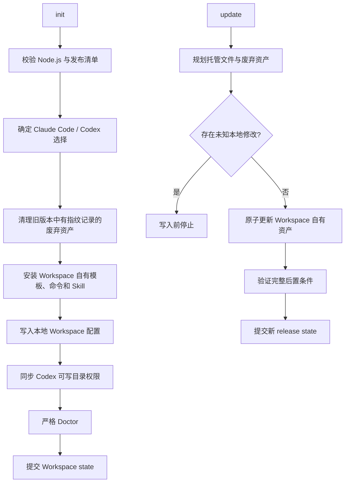
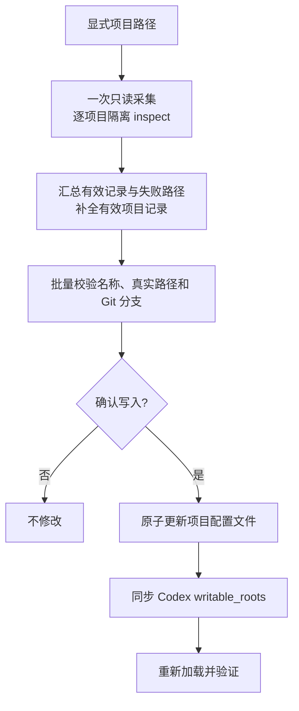
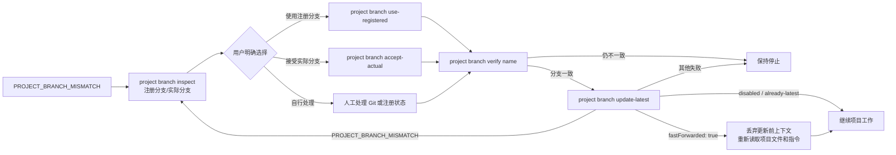

# Code Workspace 执行流程

本文描述 Workspace 的职责边界：管理多项目注册表和 Agent 安全集成，并与原生 OpenSpec 实现保持解耦。

## 核心原则

- Workspace 不安装、检测或调用其他 OpenSpec CLI。
- Workspace 不读取、创建、更新或归档 `openspec/` 下的记录。
- Workspace 的写入范围是 `.codew/`、Workspace 自有 Agent 集成、Codex hook 与权限配置。
- 项目生产代码只允许在已注册项目的 `location` 中修改；Workspace CLI 自身不执行生产代码修改。

## 初始化和维护流程



初始化和更新都不会创建或修改 `openspec/`；该目录中的已有记录始终由用户或外部工具负责。

## 项目注册流程



项目注册配置格式：

```yaml
# .codew/config.yaml
projects:
  ref: config-projects.yaml
```

```yaml
# .codew/config-projects.yaml
schemaVersion: 1
projects: []
```

初始化默认生成 `config-projects.yaml`，但 `projects.ref` 可以引用同一 `.codew` 目录下任意安全的普通文件名；内联项目数组、路径逃逸、绝对路径、URL 和 glob 等引用形式不受支持。

关键命令：

```bash
code-workspace project inspect /absolute/path/to/project --json
cat projects.json | code-workspace project add --stdin --yes --json
code-workspace project list --json
code-workspace project verify "<project-name>" --json
```

Claude Code 使用 `/code-workspace:add-projects`；Codex 使用 `$code-workspace-add-projects`。两者都要求用户给出显式路径，不得根据对话猜测。采集阶段逐项目报告失败并继续；写入阶段只接收用户确认的有效记录，并通过 `project add --stdin` 在现有全量校验和单事务内完成注册与授权。

## 分支不一致恢复



```bash
code-workspace project branch inspect "<project-name>" --json
code-workspace project branch use-registered "<project-name>" --allow-remote --yes --json
code-workspace project branch accept-actual "<project-name>" --yes --json
code-workspace project branch verify "<project-name>" --json
code-workspace project branch update-latest "<project-name>" --json
```

注册分支是 Workspace 期望状态，实际分支是目标 Git worktree 的观测状态，出现不一致时由用户选择方向。使用注册分支默认要求干净 worktree 和已存在的本地分支；`--allow-remote` 可从唯一已有远程跟踪分支创建本地 tracking 分支，`--remote <name>` 经确认后仅 fetch 指定远程的注册分支。接受实际分支只原子更新目标注册记录。两条协调命令都检查计划漂移并验证结果；分支 Skill 以 `project branch verify` 只确认分支一致性，然后由 Workspace Guard 根据所引用项目文件中的 `projects[].updateLatest` 调用 `project branch update-latest`，并以该结果作为项目工作前的最终状态门。发生 fast-forward 时，Guard 丢弃更新前上下文并重新读取项目文件和指令；跳过更新时直接继续。不再在分支协调后或 update-latest 后追加整体 `project verify`。

## 责任边界

| 层次 | 负责内容 |
| --- | --- |
| Workspace CLI | 项目注册表、定向/全量项目验证、经确认的安全分支协调、权限、Doctor、监控 |
| Workspace Agent 集成 | 显式添加项目、分支不一致恢复引导 |
| 用户或外部工具 | `openspec/` 记录的创建、编辑、同步、归档和删除 |
| 各项目仓库及用户 | 生产代码、测试、构建、分支创建、网络同步、脏 worktree 处理和冲突解决 |

## 不变量

- 不得猜测项目路径、项目归属或分支。
- AI/Agent 不得直接编辑 `.codew/config.yaml`、`projects.ref` 所引用的项目文件或权限文件；用户可以手动编辑并对结果负责。AI/Agent 的配置写入必须通过受支持的 CLI。
- 不得把独立的 `openspec/` 存储隐式绑定到 Workspace。
- Workspace 初始化、更新和 Doctor 不依赖其他 OpenSpec 包或可执行文件。
- Workspace 不读取或写入 `openspec/`。
- Workspace CLI 不编辑生产代码，不创建分支，不执行 stash/reset，也不处理 Git 冲突；仅对显式启用 `updateLatest` 的项目执行 upstream fetch 和 fast-forward。
