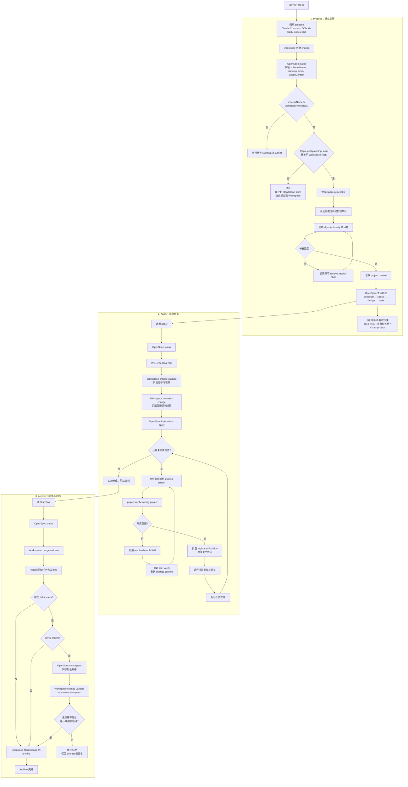
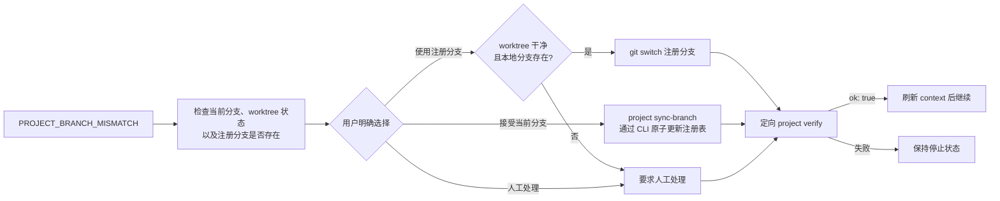

# OpenSpec Workspace 执行流程

以下流程以 `workspace-workflow` 为例。

核心原则：

- OpenSpec 管理 proposal、spec、design、tasks、apply、sync 和 archive 生命周期。
- OpenSpec Workspace 负责多项目选择、项目边界、定向验证和安全恢复。
- 普通 `spec-driven` schema 直接执行原生 OpenSpec 工作流。

## 完整执行流程



## 分支不一致恢复流程



## 责任边界

| 层次 | 负责内容 |
| --- | --- |
| OpenSpec | change、proposal、spec、design、tasks、apply、sync、archive |
| Workspace CLI | 项目注册表、定向验证、change ownership、主规格后置检查 |
| Resolve-branch Skill | 用户确认、Git 安全检查、分支恢复 |
| OpenSpec 补丁 | 串联上述能力并限制生产代码编辑范围 |

## 关键命令

### 项目发现

```bash
openspec-workspace project list --json
```

### 项目定向验证

```bash
openspec-workspace project verify "<project-name>" --json
```

### Change 验证

```bash
openspec-workspace change validate "<change-name>" --json
```

### 获取 Change 相关项目上下文

```bash
openspec-workspace context --change "<change-name>" --json
```

### 同步后的主规格验证

```bash
openspec-workspace change validate "<change-name>" \
  --require-main-specs \
  --json
```

### 接受项目当前分支

```bash
openspec-workspace project sync-branch "<project-name>" \
  --yes \
  --json
```

## 关键约束

- 不得猜测项目路径、项目归属或分支。
- 不得直接修改 `.openspec-workspace/config.yaml`。
- `PROJECT_BRANCH_MISMATCH` 必须委托给 `openspec-workspace-resolve-branch`。
- apply 只能修改任务所属项目的 registered `location`。
- `Cross-project` 只能包含协调、契约和集成验证任务。
- `workspace-workflow` 只适用于 repo-local planning home。
- standalone OpenSpec store 不会隐式绑定到当前 Workspace。
- 以下 Markdown 标记属于不可翻译的协议字段：
  - `Affected Projects`
  - `Capabilities`
  - `New Capabilities`
  - `Modified Capabilities`
  - `Project`
  - `Capability`
  - `Cross-project`
