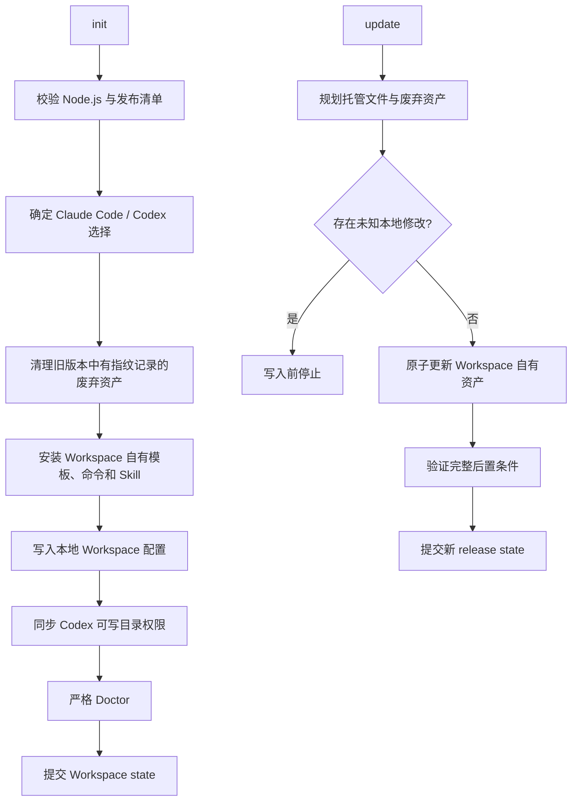
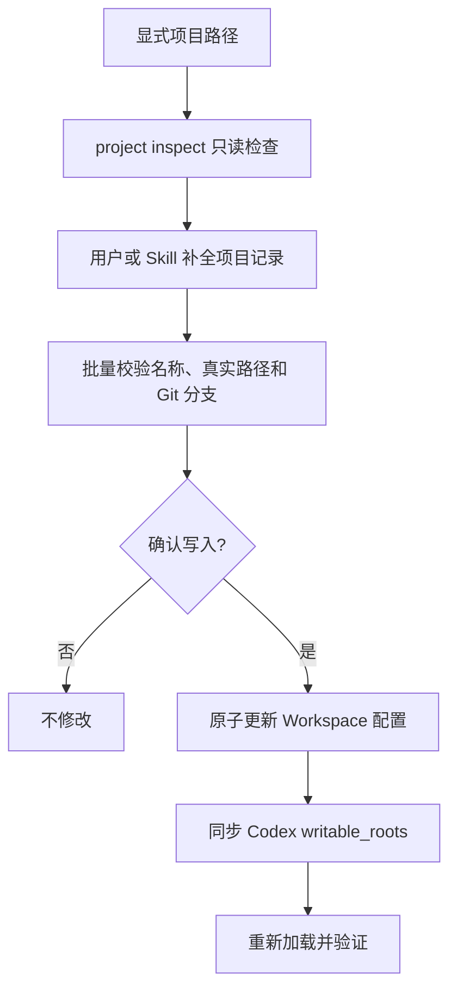
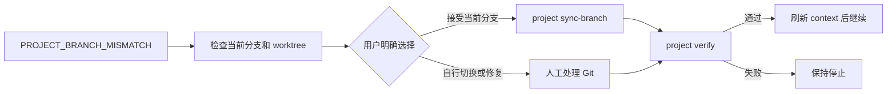

# OpenSpec Workspace 执行流程

本文描述 Workspace 的职责边界：管理多项目注册表和 Agent 安全集成，并与原生 OpenSpec 实现保持解耦。

## 核心原则

- Workspace 不安装、检测或调用其他 OpenSpec CLI。
- Workspace 不读取、创建、更新或归档 `openspec/` 下的记录。
- Workspace 的写入范围是 `.openspec-workspace/`、Workspace 自有 Agent 集成、Codex hook 与权限配置。
- 项目生产代码只允许在已注册项目的 `location` 中修改；Workspace CLI 自身不执行生产代码修改。

## 初始化和维护流程



初始化和更新都不会创建或修改 `openspec/`；该目录中的已有记录始终由用户或外部工具负责。

## 项目注册流程



关键命令：

```bash
openspec-workspace project inspect /absolute/path/to/project --json
openspec-workspace project add --projects-file projects.json --yes --json
openspec-workspace project list --json
openspec-workspace project verify "<project-name>" --json
```

Claude Code 使用 `/opswx:add-projects`；Codex 使用 `$openspec-workspace-add-projects`。两者都要求用户给出显式路径，不得根据对话猜测。

## 分支不一致恢复



```bash
openspec-workspace project sync-branch "<project-name>" --yes --json
```

`project sync-branch` 只接受仓库当前分支并更新注册表，不执行 `git switch`。

## 责任边界

| 层次 | 负责内容 |
| --- | --- |
| Workspace CLI | 项目注册表、项目验证、权限、Doctor、监控 |
| Workspace Agent 集成 | 显式添加项目、分支不一致恢复引导 |
| 用户或外部工具 | `openspec/` 记录的创建、编辑、同步、归档和删除 |
| 各项目仓库 | 生产代码、测试、构建和 Git 分支操作 |

## 不变量

- 不得猜测项目路径、项目归属或分支。
- 不得直接编辑 `.openspec-workspace/config.yaml`；通过 CLI 写入。
- 不得把独立的 `openspec/` 存储隐式绑定到 Workspace。
- Workspace 初始化、更新和 Doctor 不依赖其他 OpenSpec 包或可执行文件。
- Workspace 不读取或写入 `openspec/`。
