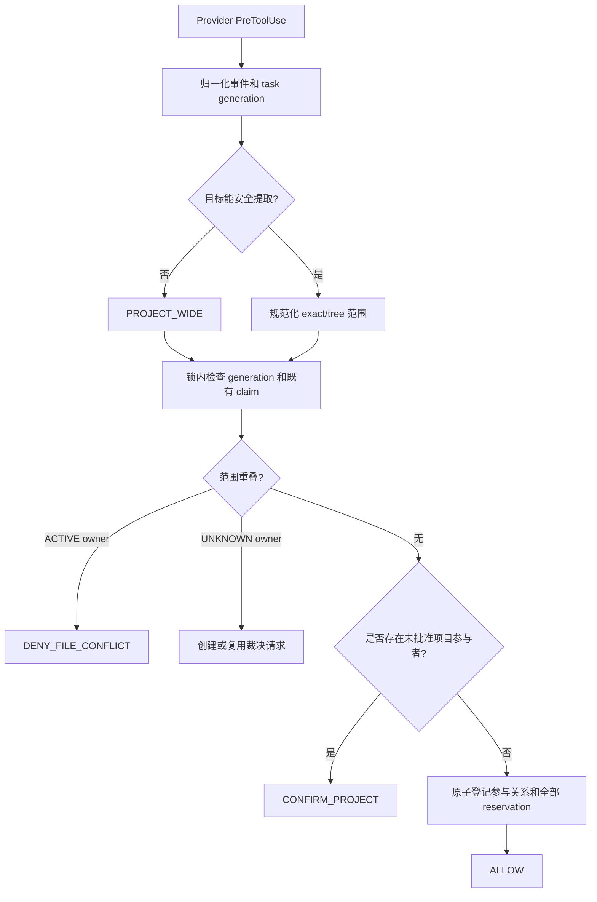
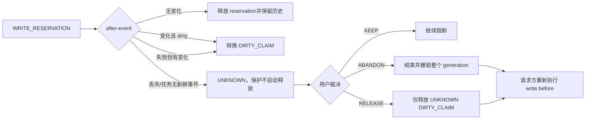

# Agent 写入协调设计

本文说明 Code Workspace 并行 Agent 写入协调的需求目的、设计理念和责任边界。它是面向维护者、集成开发者和使用 Workspace 的团队的说明性文档；稳定的字段、错误码和事件语义以当前实现及对应 OpenSpec 变更为准。

## 1. 需求目的

多个 Codex 或 Claude 任务可能同时处理同一个项目。完全禁止并行会降低开发效率，但完全依赖 Agent 自觉避让又无法防止两个任务同时改写同一文件。因此，本机制把风险拆成两个不同的问题：

1. **同项目、非重叠范围**：允许并行，但在第二个任务首次写入前明确告知用户并取得一次项目并行确认。
2. **重叠写入范围**：必须在实际工具运行前强制阻断，不能用项目确认或 `--force` 绕过。

机制还必须处理 Hook 丢失、任务崩溃、长时间工具调用和事件乱序等异常，而不能把一个暂时无人处理的预约悄悄当成已释放。

本需求的目标是：

- 为每个跨任务写入建立可追踪的任务身份和生命周期；
- 在写入前预约目标范围，在写入后根据实际变化转换为 dirty claim 或释放；
- 让多文件登记具有全有或全无语义，避免部分预约；
- 在 `UNKNOWN` 状态下保留完整证据，提供可审计、可恢复的人工裁决；
- 使 Codex 和 Claude 共享同一套协调核心，只由适配器承担原生 Hook 差异；
- 在 Monitor 不可用、未安装或被移除时，协调仍可独立工作；
- 让所有阻断都给出稳定错误码、冲突对象和下一步处理方式。

本需求明确不追求以下目标：

- 不协调同一任务内部的子 Agent；子 Agent 归属于父任务，不形成新的跨任务 owner；
- 不实现跨机器、分布式租约或常驻 Broker；
- 不把 Git dirty 状态当成写入前互斥锁；
- 不通过通用 shell 文本解析证明任意脚本的精确写入集合；
- 不拦截绕过受支持 Hook 的编辑器、用户 Shell、外部进程或未支持 Provider；
- 不替用户提交、还原、stash、reset 或解决项目生产代码冲突。

## 2. 设计理念

### 2.1 任务身份必须包含 generation

任务身份由以下字段共同确定：

```text
workspaceUuid + provider + nativeSessionId + generation
```

同一个原生 session 结束后重新启动，必须创建新的 generation。用户放弃旧 generation 后，旧事件、旧 `PreToolUse` 和旧 `PostToolUse` 都不能重新激活它，也不能释放新任务的 claim。子 Agent 的 `agent_id`、`agent_type` 和进程信息作为证据保存，但 owner 仍然是父 session 的当前 generation。

### 2.2 生命周期表示证据新鲜度，而不是锁过期

任务只有三种状态：

| 状态 | 含义 | 对保护对象的影响 |
| --- | --- | --- |
| `ACTIVE` | 最近有可信事件 | 正常参与项目确认和范围冲突判断 |
| `UNKNOWN` | 超过活动阈值没有可信事件，终止原因未知 | 保留全部保护，等待证据和人工裁决 |
| `ENDED` | 收到 `SessionEnd`，或完成合法的 UNKNOWN abandon | 停止保护效力，保留审计历史 |

15 分钟活动阈值（可注入测试时钟）只表示“当前证据不新鲜”，不是预约或 dirty claim 的过期时间。`Stop` 只表示一次回复或 turn 结束，不能单独结束任务。进程不存在、Git clean 或文件未变化也只能作为裁决证据，不能自动把 `UNKNOWN` 变成 `ENDED`。

### 2.3 项目告知与文件互斥是两种不同语义

协调对象分为三类：

| 对象 | 设计语义 | 用户能否覆盖 |
| --- | --- | --- |
| 项目参与关系 | 告知同项目已有其他任务，并缓存成对 generation 的并行批准 | 可以批准后重试 |
| 文件范围 claim | 保护实际写入范围，阻止重叠 owner | `ACTIVE` 冲突不可覆盖；`UNKNOWN` 必须先裁决 |
| ledger mutex | 仅用于短时串行化台账事务 | 不面向用户覆盖，繁忙时有界失败并重试 |

项目并行批准不能替代文件范围检查。先判断 `PROJECT_WIDE` 和文件/tree 重叠，再判断是否需要项目确认，确保“用户允许并行”不会变成“允许互相覆盖”。

### 2.4 写入保护分为 reservation 和 dirty claim

写入前创建 `WRITE_RESERVATION`，记录 owner、`operationId`、规范化范围、工具和写入前 fingerprint/Git 证据。工具结束后：

- fingerprint 未变化：释放 reservation；
- 文件发生变化且仍 dirty：转换为 `DIRTY_CLAIM`；
- 工具失败但留下修改：同样创建 dirty claim；
- 工具自行提交或还原并恢复 clean：释放 reservation，只保留历史。

`ACTIVE` dirty claim 在后续证实 dirty-to-clean 时可以停止互斥效力；`UNKNOWN` dirty claim 即使已经 clean，也只能更新证据，不能自动释放。对 `UNKNOWN WRITE_RESERVATION` 不允许单独释放一个 claim，因为缺失 after-event 仍可能意味着旧工具尚未开始写入；安全解除必须放弃整个 generation，并撤销其迟到事件。

### 2.5 范围先规范化，未知写入扩大保护

目标路径必须关联到已注册项目，并在项目 real path 内完成 canonical 化：已存在路径使用 realpath，未存在文件使用最近已存在父目录的 realpath。符号链接、`..`、平台大小写别名或路径逃逸不得绕过重叠判断。

范围统一为：

- `EXACT_FILE`：单个规范化文件；
- `DIRECTORY_TREE`：目录及其后代；
- `PROJECT_WIDE`：项目内所有可能写入。

能力表能可靠提取目标时使用 exact/tree；无法证明目标集合的 Shell、动态脚本或未知工具使用 `PROJECT_WIDE`。已有项目参与者或 claim 时，新的未知写入直接返回 `DENY_UNKNOWN_WRITE_SCOPE`，不通过项目确认放行。

### 2.6 台账事务短、原子、fail closed

协调台账存放在 Workspace 外部的用户状态目录，并按 Workspace UUID 与 canonical real path 隔离。单一 `proper-lockfile` mutex 只保护以下短时操作：读取台账、核对 revision、应用纯内存状态转换和原子写入。

mutex 内禁止等待用户、执行 Provider 工具、运行 Git、采集 fingerprint 或获取第二把协调锁。需要文件/Git/进程证据时采用两阶段乐观流程：

```text
锁内读取 revision 和相关记录
→ 解锁采集证据
→ 重新加锁核对 revision、generation、claim revision
→ 未变化则提交；变化则有界重试或安全拒绝
```

台账解析失败、schema 不兼容或原子写失败时必须 fail closed，保留原文件和备份，并返回台账位置、稳定错误码和恢复建议；绝不能静默创建空台账覆盖既有 owner 信息。

### 2.7 人工裁决必须可审计且不直接授权请求者

命中 `UNKNOWN` owner 时，系统生成去重的 decision request，至少展示：任务身份和状态、phase、最后事件、claim 类型和范围、operation、前后 fingerprint、Git 状态、dirty-to-clean 证据、进程证据、ledger/claim revision、evidence hash 及动作后果。

裁决采用：

```text
inspect → plan → stale validate → user confirmation → apply → postcondition verify
```

裁决只改变旧 owner 的状态、claim 或项目批准，不直接替被阻断的请求任务创建 reservation。裁决成功后，请求方必须重新执行完整的 `write.before` 检查。用户确认期间不持有 ledger mutex，避免交互时间造成锁等待或死锁。

### 2.8 Provider 无关核心，适配器隔离原生差异

Codex 和 Claude 的原生事件先转换为统一 envelope，再进入协调核心。统一事件包括：

- `task.started`、`task.activity`、`task.waiting`、`task.turn-ended`、`task.ended`；
- `write.before`、`write.after`。

统一决策包括 `ALLOW`、`CONFIRM_PROJECT`、`DENY_FILE_CONFLICT`、`DENY_UNKNOWN_WRITE_SCOPE`、`UNKNOWN_OWNER_DECISION_REQUIRED` 和 `RETRY_COORDINATION_FAILURE`。新增 Provider 时只增加事件适配、工具能力表和 native renderer，不复制生命周期或 claim 逻辑。

### 2.9 协调与 Monitor 解耦

Monitor 可以展示协调状态，但不能决定任务是 `ACTIVE`、`UNKNOWN` 还是 `ENDED`，也不能持有 claim 或参与放行。协调 Hook 不调用 `monitor report`、Monitor HTTP API 或 Monitor 内存状态；Monitor 未启动、不可访问或完全移除时，写入协调仍按同一规则执行。

## 3. 核心流程

### 3.1 写入前



### 3.2 写入后与恢复



## 4. 责任边界

### 4.1 Workspace 协调核心

协调核心负责：

- 任务身份、generation、三态生命周期和 revoked 检查；
- 项目参与关系、项目批准缓存和失效；
- 路径 canonical 化、范围去重和重叠判定；
- fingerprint/Git/进程证据采集的协调与 revision 重验；
- reservation、dirty claim、审计历史和人工裁决的原子状态转换；
- ledger 外部存储、mutex、备份、权限和 fail-closed 诊断；
- 为 Hook 和 CLI 提供稳定 API、错误码和后置验证。

核心不负责执行实际 Provider 工具，也不负责替用户决定是否放弃 UNKNOWN 任务。

### 4.2 Provider Hook 适配器和 runner

适配器/runner 负责：

- 读取并校验 Codex/Claude 原生 Hook 输入；
- 生成稳定 `eventId`、保留 `operationId` 并填充统一 envelope；
- 根据版本化能力表提取 exact/tree/project-wide 范围；
- 调用协调核心并渲染 Provider 原生 allow/block 结果；
- 在 PreToolUse 内部异常时 fail closed；
- 记录子 Agent 观察信息，但把 owner 归并到父任务。

适配器不负责复制 claim 算法、直接写 ledger、等待用户输入或执行被阻断的工具。

### 4.3 CLI

CLI 负责只读查询和人工裁决入口：

- `task list`、`task show`、`task lock list`、`task decision show`；
- `task decision keep|approve|release|abandon`；
- 展示稳定结果 envelope、错误 details、证据和 remediation；
- 对 planned-write 裁决执行 inspect → plan → confirm → apply → verify；
- 在 JSON/非 TTY 下要求显式 `--yes`，不得交互提示。

CLI 不直接读写 ledger、不运行 Provider 工具、不替请求任务创建 reservation，也不能为 `ACTIVE` 文件冲突提供覆盖选项。

### 4.4 Managed 安装与用户

Managed 安装负责：

- 为选中的 Codex/Claude 工具提供协调 Hook 制品；
- 保留现有用户 Hook、permissions 和 Monitor 配置；
- 在 update/rollback 时验证未知修改并避免半安装状态；
- 明确 Hook 信任、启用和支持范围。

用户负责：

- 审阅并信任所安装的 Provider Hook；
- 在同项目并行写入和 UNKNOWN 裁决时作出明确选择；
- 在 abandon 前确认旧 Agent/工具进程已停止；
- 处理 Git 提交、还原、stash、分支和实际代码冲突。

### 4.5 Monitor、Git 与外部工具

| 参与者 | 可以提供的内容 | 不承担的责任 |
| --- | --- | --- |
| Monitor | 只读展示、事件观察、后续报表 | 不决定生命周期、不持有 claim、不放行写入 |
| Git | tracked/dirty/rename/ignored 等路径证据 | 不替代 reservation，不证明 Agent 已结束 |
| 操作系统/进程检查 | PID、启动标识、父子关系和存活证据 | 不自动结束 UNKNOWN，不提供 OS 级写入沙箱 |
| 编辑器、用户 Shell、外部进程 | 可能直接改变项目文件 | 不受本机制的强制阻断范围覆盖 |
| 项目仓库和用户 | 生产代码、测试、构建、提交和冲突处理 | 不应把 Workspace 台账当作 Git 历史或提交状态 |

## 5. 安全边界与已知限制

- 强制互斥只覆盖已安装、已启用、已信任且经过支持的 Provider Hook 入口；绕过 Hook 的写入无法由本机制保证。
- 未知或无法安全提取目标的工具使用 `PROJECT_WIDE`，会牺牲并行度换取安全范围；并发项目中可能直接被拒绝。
- `UNKNOWN` 可能在用户处理前持续阻断写入，这是安全恢复路径的一部分，不是自动过期锁。
- 进程存活检查受 PID 复用、远程会话和平台能力影响，只能辅助人工裁决。
- ledger 是本机 Workspace 级状态，不提供跨机器一致性；用户状态目录损坏或权限不足时，写入会 fail closed。
- 工具版本变化可能改变原生字段或工具名；适配器通过版本化 fixture 和能力表固化已知支持范围，未知输入默认按可能写入处理。
- 本机制协调“谁可以开始写”，不保证外部写入者在工具运行期间不修改文件，也不替用户解决业务层合并冲突。

## 6. 支持矩阵

| Provider | 生命周期 Hook | 写入 Hook | 范围策略 |
| --- | --- | --- | --- |
| Codex | `SessionStart`、`UserPromptSubmit`、`PermissionRequest`、`Stop`、`SessionEnd` | `PreToolUse`、`PostToolUse` 及可用失败事件 | Edit/Write 类已知工具使用 exact；未知 Shell/工具使用 `PROJECT_WIDE` |
| Claude | `SessionStart`、`UserPromptSubmit`、`PermissionRequest`、`Stop`、`StopFailure`、`SessionEnd` | `PreToolUse`、`PostToolUse`、`PostToolUseFailure` | 使用同一归一化核心决策、范围和裁决规则 |

该矩阵描述当前 schema v1 的适配边界，不承诺未来 Codex/Claude 版本保持完全相同的原生字段。新增工具或事件应先增加 fixture、能力分类和 renderer 验证，再扩大支持范围。

